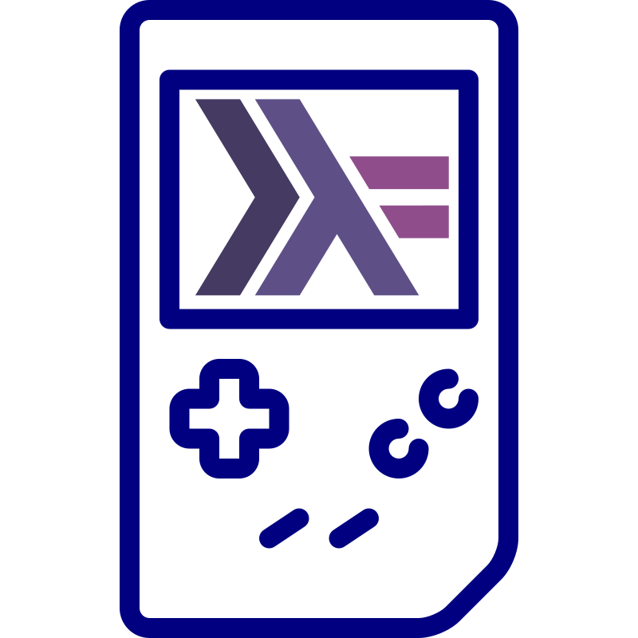

<div align="center">
  <picture>
    
  </picture>
<br>

<h2>Ocelot</h2>

[](https://github.com/pixel-clover/ocelot/actions/workflows/tests.yml)
[](https://github.com/pixel-clover/ocelot/actions/workflows/lints.yml)
[](https://codecov.io/gh/pixel-clover/ocelot)
[](https://github.com/pixel-clover/ocelot/blob/main/LICENSE)
[](https://pixel-clover.github.io/ocelot/)
<br>
[](https://github.com/orgs/pixel-clover/packages/container/package/ocelot-web)
[](https://github.com/pixel-clover/ocelot/releases/latest)

A Nintendo Game Boy and Game Boy Color emulator in Haskell λ

</div>

---

**Download the latest desktop version of Ocelot from [here](https://github.com/pixel-clover/ocelot/releases)
or [try Ocelot in your web browser](https://pixel-clover.github.io/ocelot/).**

Footage of Ocelot running a few games:

<div align="center">

<table>
  <tr>
    <td align="center" width="33%"><br>The Legend of Zelda: Link's Awakening</td>
    <td align="center" width="33%"><br>Adventure Island</td>
    <td align="center" width="34%"><br>Final Fantasy Adventure</td>
  </tr>
  <tr>
    <td align="center" width="33%"><br>The Legend of Zelda: Link's Awakening DX</td>
    <td align="center" width="33%"><br>Wario Land 3</td>
    <td align="center" width="34%"><br>Super Mario Bros. Deluxe</td>
  </tr>
</table>
</div>

### Key Features

- Accurate Game Boy and Game Boy Color emulation
- Very portable; run on Windows, Linux, and macOS, and also in the browser via WebAssembly
- Very configurable, including gameplay input, frontend hotkeys, and rendering settings
- Has a permissive license that allows commercial use

See [ROADMAP.md](ROADMAP.md) for the list of implemented and planned features.

> [!IMPORTANT]
> This project is still in early development, so compatibility is not perfect.
> Bugs and breaking changes are also expected.
> Please use the [issues page](https://github.com/pixel-clover/ocelot/issues) to report bugs or request features.

---

### Quickstart

#### Download the Latest Release

##### A. Desktop

You can download the latest pre-built binaries from the project's [release page](https://github.com/pixel-clover/ocelot/releases).

##### B. Web

You can download and use the latest pre-built Docker image for the web version of Ocelot from the
[GCR](https://github.com/orgs/pixel-clover/packages/container/package/ocelot-web):

```bash
docker run -d -p 8085:80 --rm ghcr.io/pixel-clover/ocelot-web:latest
```

Then open http://localhost:8085 in your browser.

#### Build Ocelot from Source

Alternatively, you can build the emulator from source by following the steps below.

##### 1. Clone the repository

```bash
git clone --depth=1 https://github.com/pixel-clover/ocelot.git
cd ocelot
```

> [!NOTE]
> If you want to run the tests and develop Ocelot further, you need to clone the repository with
> `git clone --recursive https://github.com/pixel-clover/ocelot.git`.
> Test ROMs can then be fetched with `make test-roms`.

##### 2. Build the Ocelot Binary

```bash
# This can take some time
make release
```

If the build is successful, you can find the built binary at `$(stack path --local-install-root)/bin/ocelot`.

#### Run the Emulator

Run the `ocelot` binary to start the emulator GUI:

```bash
ocelot
```

Help menu while the emulator is running:

<div align="center">

</div>

Run `ocelot --help` to see the list of available command-line options.

Example output:

```
Ocelot 0.1.0.0 (develop@7bb29) - Game Boy (DMG) and Game Boy Color (CGB) emulator in Haskell

Usage: ocelot [-V|--version] COMMAND

Available options:
  -h,--help                Show this help text
  -V,--version             Print the version and exit

Available commands:
  play                     Run the ROM in the SDL frontend (default mode). Pass
                           --boot-rom to start from a DMG/CGB boot ROM instead
                           of the post-boot register state.
  headless                 Step the CPU for a fixed number of instructions and
                           dump the final state (registers, serial output,
                           disassembly, memory hex dump, VRAM tile preview,
                           framebuffer) to the terminal.
  audio-test               Play a 440 Hz sine tone for 2 seconds via SDL. No ROM
                           needed; verifies the SDL audio path.
  info                     Print the ROM's cartridge header and exit.

SDL key bindings (play): Z=A, X=B, Enter=Start, RShift=Select, Arrows=D-pad,
Space=pause, F1=help overlay, .=frame step, Tab=fast-fwd (held), R=reset,
F5=save state, F6=cycle slot (1-5), F7=load state, F12=screenshot, Escape=quit.
```

---

### Contributing

See [CONTRIBUTING.md](CONTRIBUTING.md) for details on how to make a contribution.

### License

Ocelot is licensed under the MIT License (see [LICENSE](LICENSE)).

### Acknowledgements

* The logo is made of [image 1](https://www.svgrepo.com/svg/28849/old-game boy-console) and [image 2](https://www.svgrepo.com/svg/373660/haskell).
* This project uses the following resources (for different things like testing, frontend, etc.):
    * [gb-test-roms](https://github.com/retrio/gb-test-roms)
    * [mooneye-test-suite](https://github.com/Gekkio/mooneye-test-suite)
    * [dmg-acid2](https://github.com/mattcurrie/dmg-acid2) and [cgb-acid2](https://github.com/mattcurrie/cgb-acid2)
    * [JetBrains Mono](https://github.com/JetBrains/JetBrainsMono)
    * [SDL](https://github.com/libsdl-org/SDL)

#### Reference Implementations

Ocelot's implementation logic was checked with the following reference material for finding errors and verifying correctness:

* [Pan Docs](https://gbdev.io/pandocs/)
* [SameBoy](https://github.com/LIJI32/SameBoy)
* [Game Boy: Complete Technical Reference](https://gekkio.fi/files/gb-docs/gbctr.pdf)
